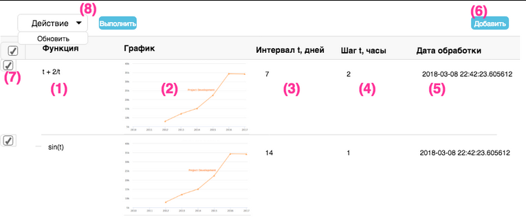

## Установка / Installation

    git clone ...
    cd 857a3e3e788f40f4b7523fcb9eeb94b/server
    docker-compose build

## Запуск / Run

    docker-compose up

## Текущий статус проекта / Present state of this project

На данный момент проект соответствует заданию ниже на 90%. Отсутствует RabbitMQ и нет обновления времени обработки

At the moment the project corresponds to the task below for 90%. No RabbitMQ and no processing time update

## Задание / Task

### Text was translated to english by me with usage of Google Translate
#### (I am capable of coming up with translation like this, I am just too lazy to translate)

Необходимо разработать приложение, которое позволит пользователю моделировать работу функций y=f(t)
и анализировать соответствующие графики.
Пример функции: y=t*t + 2/t, где
t - unixtime в интервале [datetime.now() - interval, datetime.now()] с шагом dt, 
Interval - глубина периода моделирования в днях
datetime.now() - дата обработки
dt - шаг в часах

Needs to develop an application that will allow the user to simulate the functions y = f (t) and analyze 
the corresponding graphs.
Function example: y = t*t + 2/t, where
t - unixtime in the interval [datetime.now () - interval, datetime.now ()] with step dt,
Interval - the depth of the simulation period in days
datetime.now () - processing date
dt - step in hours 

#### User story

Пользователь заходит в админку, видит список ранее сохраненных функций (1), соответствующие графики (2),
дату последней обработки (5), параметры (3) и (4), а также кнопку добавить (6). 

The user enters the admin panel, sees a list of previously saved functions (1), corresponding graphs (2),
the last processing date (5), parameters (3) and (4), and the add button (6). 

* Пользователь жмет кнопку добавить (6), вводит функцию (1) в текстовом виде, а также значение dt и interval.
* Введенная информация сохраняется в БД. Запиcи в БД уникальны только по ID.
* Приложение генерирует изображение для введенной функции и сохраняет результат в БД. 
* Если возникает ошибка - то сохраняется текст исключения (он выводится вместо графика).
* После обработки обновляется поле дата обработки (5).
* По завершению обработки вновь открывается список (1), в которой появляется строка с только что введенной функцией, 
пользователь видит в строке с функцией график или текст исключения, введенные параметры и дату обновления.
  

* The user clicks the add button (6), enters function (1) in text form, as well as the dt and interval values.
* The entered information is saved in the database. Database records are unique only by ID.
* The application generates an image for the entered function and saves the result to the database.
* If an error occurs, the exception text is saved (it is displayed instead of the graph).
* After processing, the processing date field (5) is updated.
* Upon completion of processing, the list (1) is reopened, in which a line with the newly entered function appears,
the user sees in the line with the function the graph or the text of the exception, the entered parameters and the update date. 

#### System story

Приложение состоит из одного django приложения. Сценарий при добавлении новой функции в админке:
* Админка сохраняет инфу о функции в БД и запускает фоновую операцию генерации изображения. 
* Запуск операции происходит через асинхронный вызов операции celery с ожиданием результата. 
* Операция выполняется в фоновой задаче celery.task  в отдельном процессе celery worker.
* Операция принимает в аргументах идентификатор строки с инфой о функции из БД. 
* Операция выбирает инфу о функции из БД по переданному айдишнику, генерирует точки для графика по выбранной инфе.
* Операция генерирует изображение по точкам и сохраняет в БД, актуализирует дату обновления.
* Админка дожидается генерации изображения и редиректит пользователя на список функций, в которой отображается график
с строке с только что добавленной функции.

The app consists of one django app. Scenario when adding a new function in the admin panel:
* The admin panel saves information about the function in the database and starts the background image generation operation.
* The operation is started through an asynchronous call to the celery operation, waiting for the result.
* The operation is performed in the celery.task in a separate celery worker process.
* The operation takes in the arguments the identifier of the line with the info about the function from the database.
* The operation selects information about the function from the database according to the transmitted ID,
  generates points for the graph according to the selected info.
* The operation generates an image point by point and saves it to the database, updates the update date.
* The admin panel is waiting for the image to be generated and redirects the user to the list of functions, 
  which displays the graph
with the line with the newly added function. 

#### Требования к реализации / Requirements for implementation

* Приложение разместить в одном репозитории github или bitbucket.
* Название репозитория должно состоять из рандомного хэша.
* Для БД использовать Postgresql.
* Для реализации приложения использовать django. 
* Для фоновых задач использовать celery, шину сообщений RabbitMQ, бэкенд результатов Redis.
* Графики можно генерить самостоятельно, например через matplotlib.

* Place the application in one github or bitbucket repository. 
* The repository name must consist of a random hash.
* Use Postgresql for the database.
* To implement the application, use django.
* For background tasks use celery, RabbitMQ message bus, Redis results backend.
* Graphs can be generated independently, for example through matplotlib. 

#### Желательно / Would be a plus

* Будет плюсом, если для развертывания приложения и необходимых инфраструктурных сервисов вы воспользуйтесь docker-compose. 
* В этом случае для графиков лучше использовать возможности готового образа highcharts.

* Using docker-compose to deploy the application and the necessary infrastructure services would be a plus.
* In this case, it is better to use the capabilities of the ready-made highcharts image for charts. 

### Ссылка на оригинальный текст задания / Link to original task description (in russian)

[link](https://docs.google.com/document/d/1HdxLKKUfOZwLS0sAF8NVfryoGZhzld5XPiGtfOaxa_4/edit#)
